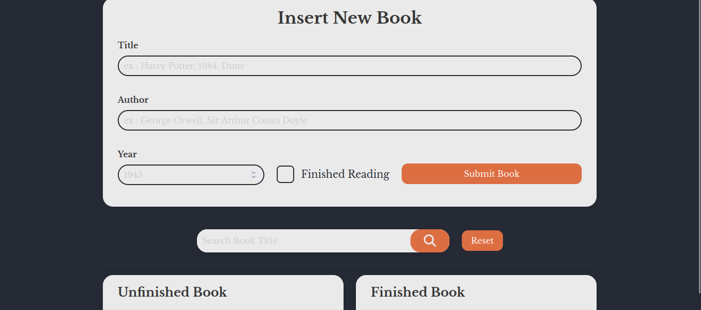

# Bookwshelf

Basically, it's the same with the Todo list website, the difference is using the book as data

[Website](https://bookshelf-42121.netlify.app/) | [Figma](https://www.figma.com/file/QqCCJqFteUMP1uyJHXkFfp/ShelfBook?node-id=0%3A1&t=eVMAZ88oDISUgP2g-1)

## Preview

